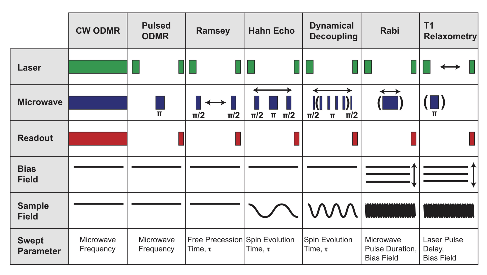
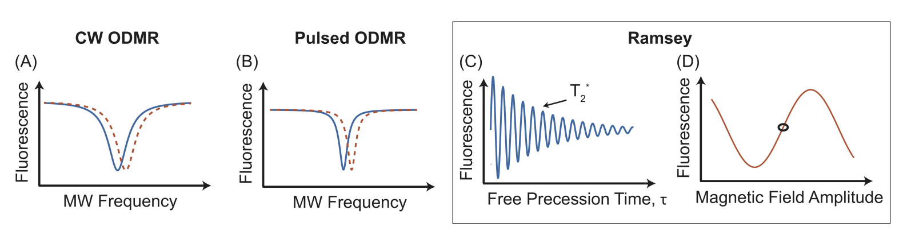
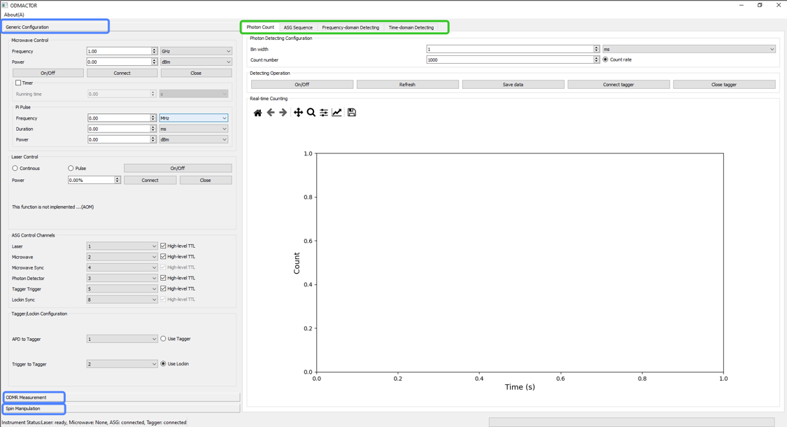
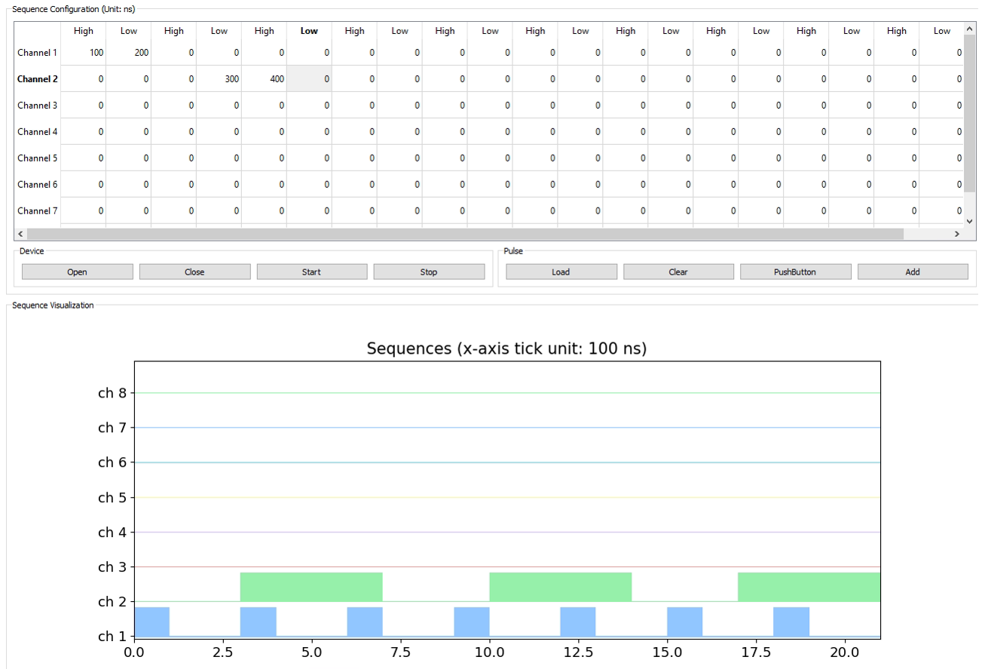
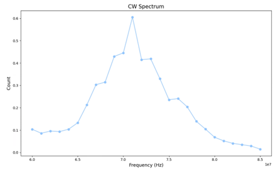
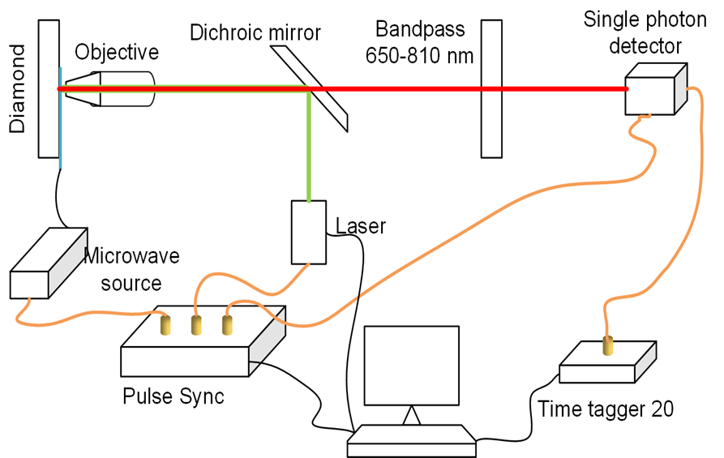

# Odmactor-GUI
GUI-version desktop application of [Odmactor](https://github.com/Youngcius/odmactor) (ODMR Actor), building on PyQt5.

## Design Method

### Measurement modes and scheduling strategies

1. Frequency-domain detection 
   *Scan MW frequencies*
    - Continuous-Wave ODMR
        1) polarize spin systems
        2) operate continuous MW and readout signals for the whole sequence period
    - Pulse ODMR
        1) polarize spin systems
        2) apply a fixed-interval MW pulse
        3) readout final fluorescence signals
2. Time-domain detection 
   *Scan time intervals*
    - Ramsey detection
        1) initialize spin to ground state
        2) initialize spin to equal-amplitude superposition state using calibrated MW $\frac{\pi}{2}$ pulse
        3) wait for a time interval $\tau$
        4) operate a calibrated MW $\frac{\pi}{2}$ pulse again
        5) readout final spin state (population)
    - Rabi oscillation
        1) initialize spin to ground state
        2) operate a short MW pulse (100~200 ns)
        3) readout final spin state (population)
    - T1 relaxation
        1) initialize spin to excited state using calibrated MW $\pi$ pulse
        2) wait a time interval $\tau$
        3) readout final spin state (population)
    - Hahn echo
      Sequences are similar with those for Ramsey detecting, while there is an additional MW π pulse between the two π/2 pulses.
    - High-order dynamical decoupling
      Sequences are similar with those for Ramsey detecting, while there are N additional MW π pulse between the two π/2 pulses.
3. Spin manipulation 
   *Currently not implemented*

The above specific scheduling methods could be abstracted into different detection sequences in experiments. They are
all controlled in precision of "ns".

Thus the series of ODMR measurement experiments is simplified by a "pipeline". CW and Pulse ODMR could be used to
characterize environmental physical quantities, while they also could be used to calibrate energy gap or fine
structures. Ramsey detecting is usually used to characterize T2* (dephasing time) of spin systems. Some typical results
of them are like the following figure.

### Operation guidance

For detailed operation guidance please reach to the software [user manual](./asset/doc/manual.docx).

Herein some illustrations are for a glance.

## Hardware support

### General ODMR platform

### Specific hardware used

Most general hardware resources are supported by our Odmactor programs. Below are some essential instruments usde in a systematic
ODMR platform and directly controlled by our programs currently used in our [QIM](https://quantum.lab.arizona.edu/) group. 

**Arbitrary Sequence Generator (ASG)**

This is the most important instrument to synchronize control measurement processes.

- Vendor: [CIQTEK](https://www.ciqtek.com/)
- Type: ASG8005
- Feature: 8 control channels

**Microwave instrument (MW)**

- Vendor: [R&S](https://www.rohde-schwarz.com)
- Type: [SMB 100A](https://www.rohde-schwarz.com/us/products/test-and-measurement/analog-signal-generators/rs-smb100a-microwave-signal-generator_63493-9379.html)

**Time Tagger (Tagger)**

This is a T/D convertor as well as A/D convertor necessary for data acquisition.

- Vendor: [Swabian](https://www.swabianinstruments.com/)
- Type: [Time Tagger 20](https://www.swabianinstruments.com/time-tagger/)
- Feature: 8 detecting channels, 34 ps jitter, 8 M tags/s

**Lock-in Amplifirer**

Lock-in is a mature manner to detect weak signals, and this device manufactured by Standford Research
is a usual lock-in amplifier.

- Vendor: [Stanford Research](https://www.thinksrs.com/)
- Type: [RS830](https://www.thinksrs.com/products/sr810830.htm)
- Feature: 1 mHz ~ 102.4 kHz range, 0.01 degree resolution

**Data Acquisition board**

NI DAQ device is used when using lock-in detecting mode instead APD with Time Tagger mode.

- Vendor: [National Instruments](https://www.ni.com/)

## Addition

### ODMR scheduling SDK 

The core scheduling algorithms of this software is based on another open-source SDK project. More details can be found
on the corresponding [GitHub Page](https://github.com/Youngcius/odmactor).

### Frequently Asked Questions

**Q: Where should I get to know more about Odmactor?**

**A:** If you have more demand or cooperation willingness, please contact to
the [Quantum Information and Materials Group](https://quantum.lab.arizona.edu) of the University of Arizona.

**Q: Can I modify this set of programs for my own research?**

**A:** Of course. The Odmactor is a set of open-source programs for promising research and education. We are glad that
more people can use or modify it. If you have more ideas or suggestions, welcome to contact to us!

### Copyright and License

Odmactor uses the [MIT license](LICENSE).
